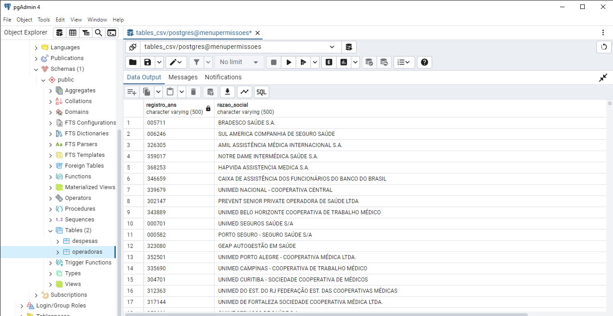
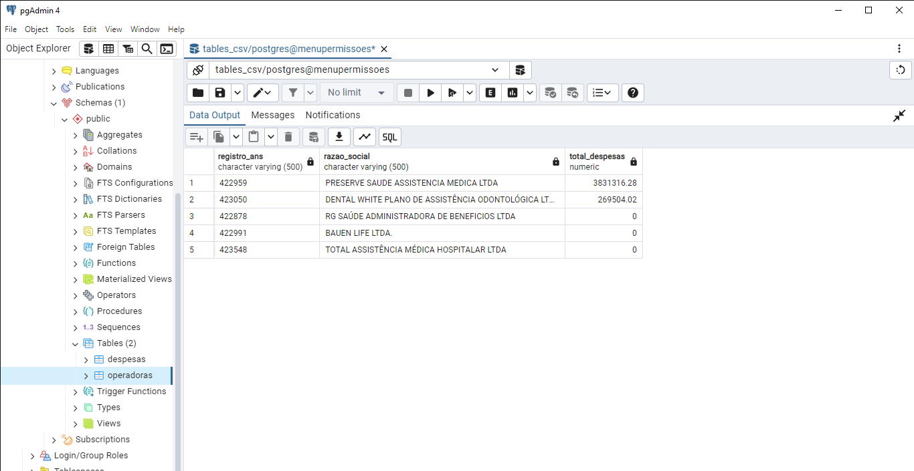
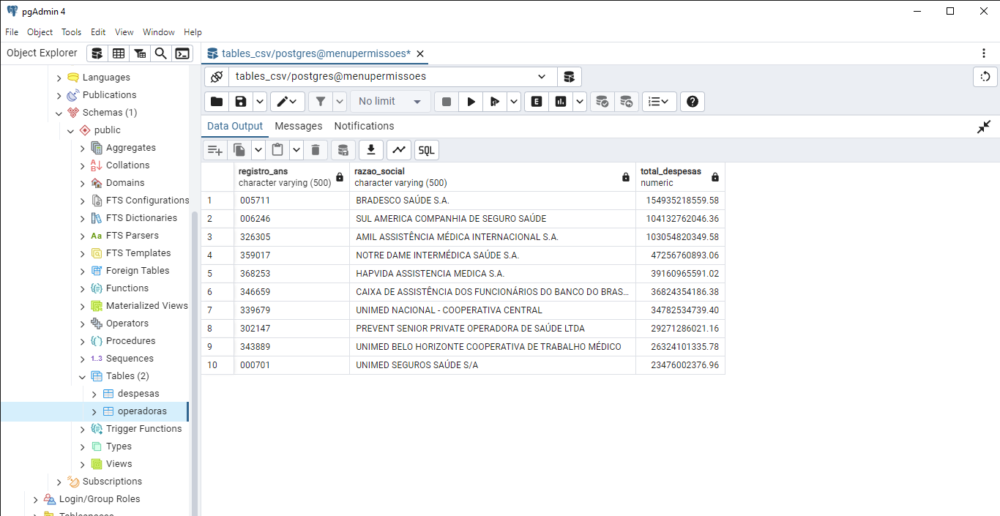

# Explicação das Queries

## Modelagem das Tabelas
As tabelas foram criadas no banco de dados utilizando PostgreSQL. Foram criadas duas tabelas principais:
- **Operadoras**: Contém informações sobre as operadoras.
- **Despesas**: Contém informações sobre as despesas.

Os nomes das colunas foram mantidos iguais aos dos arquivos CSV fornecidos, para evitar divergências de dados. Além disso, foi adicionado um campo `id` com auto incremento para gerar automaticamente um identificador único para cada registro.

## Armazenamento dos Dados
Os dados foram importados para o banco de dados utilizando o comando `COPY`, a partir dos arquivos CSV fornecidos no desafio.

## Queries

### Query 1: Seleção de Operadoras com Mais Despesas no Último Trimestre de 2024
Esta query retorna o **registro ANS**, **razão social** e o **total de despesas** das operadoras no último trimestre de 2024.

```sql
SELECT o.registro_ans, 
       o.razao_social,
       SUM(REPLACE(d.vl_saldo_final, ',', '.')::numeric) AS total_despesas
FROM operadoras o
JOIN despesas d ON o.registro_ans = d.reg_ans
WHERE (d.descricao ILIKE '%EVENTOS/ SINISTROS CONHECIDOS%' 
       OR d.descricao ILIKE '%AVISADOS DE ASSISTENCIA A SAUDE MEDICO HOSPITALAR%')
  AND d.data >= '2024-10-01'
  AND d.data <= '2024-12-31'
  AND d.vl_saldo_final IS NOT NULL
GROUP BY o.registro_ans, o.razao_social
ORDER BY total_despesas DESC;
```

### Query 2: Seleção de Operadoras com Mais Despesas no Último Trimestre de 2023
Esta query retorna o **registro ANS**, **razão social** e o **total de despesas** das operadoras que tiveram mais despesas último trimestre de 2023.

```sql
SELECT o.registro_ans, 
       o.razao_social,
       SUM(REPLACE(d.vl_saldo_final, ',', '.')::numeric) AS total_despesas
FROM operadoras o
JOIN despesas d ON o.registro_ans = d.reg_ans
WHERE (d.descricao ILIKE '%EVENTOS/ SINISTROS CONHECIDOS%' 
       OR d.descricao ILIKE '%AVISADOS DE ASSISTENCIA A SAUDE MEDICO HOSPITALAR%')
  AND d.data >= '2023-10-01'
  AND d.data <= '2023-12-31'
  AND d.vl_saldo_final IS NOT NULL
GROUP BY o.registro_ans, o.razao_social
ORDER BY total_despesas DESC;
```

### Query 3: Seleção das 10 Operadoras com maiores despesas no ultimo ano (2024)
Esta query retorna o **registro ANS**, **razão social** e o **total de despesas** das 10 operadoras que tiveram mais despesas no último ano (2024).
```sql
SELECT o.registro_ans, 
       o.razao_social, 
       SUM(REPLACE(d.vl_saldo_final, ',', '.')::numeric) AS total_despesas
FROM despesas d
JOIN operadoras o ON d.reg_ans = o.registro_ans
WHERE (d.descricao ILIKE '%EVENTOS/ SINISTROS CONHECIDOS%' 
       OR d.descricao ILIKE '%AVISADOS DE ASSISTENCIA A SAUDE MEDICO HOSPITALAR%')
  AND d.data >= '2024-01-01'
  AND d.data <= '2024-12-31'
GROUP BY o.registro_ans, o.razao_social
ORDER BY total_despesas DESC
LIMIT 10;
```

# Resultados

## Resultado da Query 1: Operadoras com Mais Despesas no Último Trimestre de 2024

Abaixo está um gráfico de barras representando as operadoras com maior valor de despesas no último trimestre de 2024.



## Resultado da Query 2: Operadoras com Mais Despesas no Último Trimestre de 2023

O gráfico abaixo exibe as operadoras com maior valor de despesas no último trimestre de 2023.



## Resultado da Query 3: Top 10 Operadoras com Mais Despesas no Ano de 2024

O gráfico abaixo apresenta as 10 operadoras com os maiores valores de despesas ao longo do ano de 2024.


